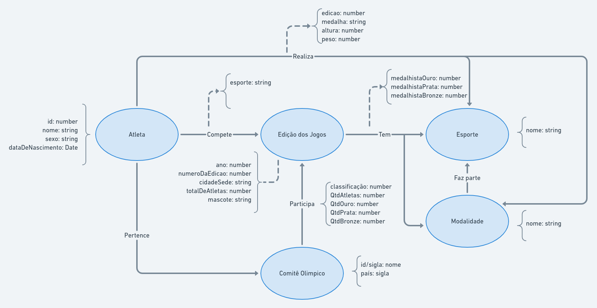

# Equipe Liga Olímpica - AJJLO
* Áureo Henrique e Silva Marques - 213374
* José Alexandre de Santos Barros - 176566
* Lindon Jonathan Sanley dos Santos Pereira Monroe - 220407

## Modelo Lógico Combinado do Banco de Dados de Grafos

## Perguntas de Pesquisa/Análise Combinadas e Respectivas Análises

### Pergunta/Análise 1
* Pergunta 1: Quais comitês ou atletas mais participaram dos jogos?
  
  * Será feita a análise de centralidade de grau sobre os nós referentes aos comitês olímpicos e aos atletas no intuito de identificar quão participativos eles foram nos Jogos Olímpicos.

### Pergunta/Análise 2
* Pergunta 2: Quantos atletas um determinado comitê já trouxe para as olimpíadas no período incluso no banco de dados?
 
  * Será feita a análise de centralidade "betweenness" sobre os nós referentes aos comitês olímpicos na relação dos nós de atletas pertencerem a um comitê e dos comitês participarem de edições dos jogos. Com isso, pode-se identificar essa questão de quantos atletas o comitê já trouxe para as Olimpíadas em geral.

### Pergunta/Análise 3
* Pergunta 3: Quais comitês trazem mais atletas para determinados esportes?

  * Será feita a análise de comunidade sobre a relação entre os nós de atletas que formam uma comunidade em torno de um comitê e entre os nós de atletas que formam comunidade em torno de um esporte. Com essas duas comunidades, a interseção entre elas pode nos revelar quais comitês possuem mais atletas em determinados esportes.
